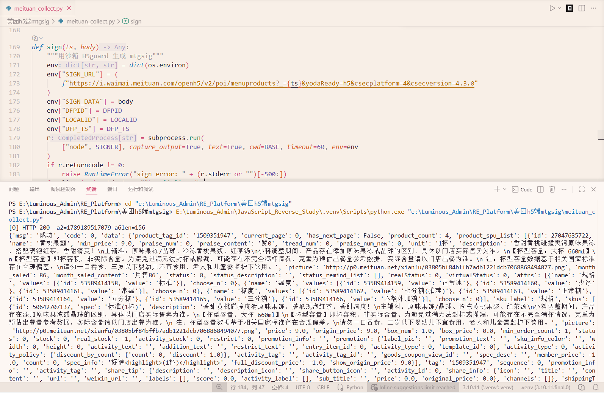

# 美团外卖 H5 端 mtgsig — 全链路逆向工程

[](https://www.python.org/)
[](https://nodejs.org/)
[](LICENSE)

针对 **h5.waimai.meituan.com** 美团外卖 H5 端接口的完整逆向工程，实现纯协议请求绕过美团风控体系（H5guard 混淆 SDK + 设备指纹 + WEBDFPID Cookie 绑定 + mtgsig 签名），并通过 Node.js `vm` 沙箱还原 `mtgsig`、无头 Chrome 自动同步登录态。

---

## 目录

- [功能特性](#功能特性)
- [防护体系总览](#防护体系总览)
- [逆向路线图](#逆向路线图)
- [技术栈](#技术栈)
- [核心难点与解决方案](#核心难点与解决方案)
- [H5guard 混淆结构](#h5guard-混淆结构)
- [项目结构](#项目结构)
- [快速开始](#快速开始)
- [运行截图](#运行截图)
- [License](#license)

---

## 功能特性

- **纯协议请求** — 不依赖浏览器自动化，直接 HTTP 请求获取店铺菜单数据
- **风控 SDK 还原** — Node.js `vm` 沙箱加载 `H5guard.js`，一键生成 `mtgsig`
- **设备指纹绑定** — 自动从 `WEBDFPID` 解析 `dfpId / dfp_timestamp / localId`
- **无头会话同步** — DrissionPage 复用已登录 Chrome 数据目录，读取 localStorage + Cookie
- **换号即用** — 手动粘贴 Cookie 或 `refresh` 刷新 `session.json` 即可切换账号
- **模块化架构** — JS 签名层与 Python 业务层分离，签名脚本可单独复用

---

## 防护体系总览

```
┌──────────────────────────────────────────────────────────────────┐
│                 h5.waimai.meituan.com 美团风控                    │
├──────────────┬──────────────────┬────────────────────────────────┤
│  层 1: 设备  │ dfpId            │ 浏览器指纹 (localStorage 采集)   │
│  指纹        │ localId          │ 设备唯一标识                     │
│              │ dfp_timestamp    │ 指纹生成时间戳                   │
├──────────────┼──────────────────┼────────────────────────────────┤
│  层 2: Cookie│ WEBDFPID         │ dfpId-时间戳-localId 拼接        │
│              │ token/mt_c_token │ 服务端据此关联 tempKey           │
├──────────────┼──────────────────┼────────────────────────────────┤
│  层 3: 风控  │ H5guard.js       │ 632KB 混淆 SDK                   │
│  SDK         │ H5guard.sign()   │ 字符串表 + 控制流平坦化 + 假分支  │
├──────────────┼──────────────────┼────────────────────────────────┤
│  层 4: 签名  │ mtgsig (JSON)    │ a2/a3 环境字段 + a5/a6 加密载荷  │
│              │ Header 携带       │ 与请求 body 强绑定               │
├──────────────┼──────────────────┼────────────────────────────────┤
│  层 5: 请求  │ menuproducts     │ body 改动后必须重新签名           │
└──────────────┴──────────────────┴────────────────────────────────┘
```

---

## 逆向路线图

```
                            ┌──────────────┐
                            │  发现目标接口  │
                            │ menuproducts │
                            └──────┬───────┘
                                   │
                    ┌──────────────▼──────────────┐
                    │  F12 抓包 / HAR 对比         │
                    │  识别 mtgsig & WEBDFPID      │
                    └──────────────┬──────────────┘
                                   │
          ┌────────────────────────┼────────────────────────┐
          │                        │                        │
  ┌───────▼───────┐        ┌───────▼───────┐        ┌───────▼───────┐
  │ mtgsig 定位     │        │ H5guard.js     │        │ 设备指纹分析   │
  │ H5guard.sign   │        │ 混淆结构还原    │        │ dfpId/localId │
  │ 调用入口        │        │ 字符串表 b()    │        │ WEBDFPID 拼接 │
  └───────┬───────┘        └───────┬───────┘        └───────┬───────┘
          │                        │                        │
          │                ┌───────▼───────┐                │
          │                │ Node vm 沙箱   │                │
          │                │ 补环境 + 注入  │                │
          │                │ dfpId          │                │
          │                └───────┬───────┘                │
          │                        │                        │
          └────────────────────────┼────────────────────────┘
                                   │
                          ┌────────▼────────┐
                          │  Python 协议层   │
                          │  requests + 签名 │
                          └────────┬────────┘
                                   │
                          ┌────────▼────────┐
                          │ 无头 Chrome 同步 │
                          │ 登录态 session   │
                          └─────────────────┘
```

---

## 技术栈

| 层级 | 技术 | 用途 |
|---|---|---|
| 协议请求 | `requests` | HTTP POST 调用 `i.waimai.meituan.com` 接口 |
| JS 执行 | Node.js `vm` 模块 | 沙箱运行 `H5guard.js` 生成 `mtgsig` |
| 会话同步 | `DrissionPage` | 无头 Chrome 复用登录数据目录，读取 Cookie/指纹 |
| 风控 SDK | `H5guard.js` | 美团 mtgsig 签名算法（混淆源码） |
| 参数编码 | `urllib.parse` | 表单 body 的 URL 编码 |
| 抓包分析 | F12 / HAR | 请求对比 & 参数验证 |

---

## 核心难点与解决方案

### 1. H5guard 混淆 SDK — `mtgsig` 动态签名

**问题**: 站点风控逻辑由 632KB 的 `H5guard.js` 承载，内部使用字符串数组 + `b(index)` 解码器 + `switch` 控制流平坦化，无法直接阅读签名算法。

**方案**: 不还原算法内部，直接在沙箱中复用 SDK 本身：
- Node.js `vm.createContext` 构造 `window/document/localStorage/navigator` 等浏览器环境
- 注入设备指纹 `dfpId/localId/dfp_timestamp` 与请求 `url/data`
- 调用 `H5guard.sign(...)` → 异步返回 `headers.mtgsig`

### 2. mtgsig 与请求体强绑定

**问题**: `mtgsig` 对本次请求的 `url`、`body`、`method` 一并签名，任何字段改动都会导致校验失败。

**方案**: `standalone_sign.js` 通过环境变量 `SIGN_URL / SIGN_DATA` 接收本次请求信息，Python 在 `sign()` 中先构造 body 再签名，保证二者完全一致。

### 3. 设备指纹 `dfpId / localId / dfp_timestamp`

**问题**: `mtgsig` 的生成依赖浏览器 `localStorage` 中的设备指纹，纯 Python 环境无法凭空构造。

**方案**: `refresh_session.py` 用无头 Chrome 复用**已登录**的浏览器数据目录，读取三个指纹字段与全部 Cookie 写入 `session.json`。

### 4. WEBDFPID Cookie 拼接

**问题**: `WEBDFPID` 的格式为 `dfpId-dfp_timestamp-localId`，服务端据此关联 `tempKey`，缺失或错位即触发风控。

**方案**: `_resolve_fingerprint()` 从 Cookie 反解三要素；`load_session()` 每次请求前重新拼接并写入 Cookie。

### 5. Node.js 沙箱环境消除

**问题**: `H5guard.js` 会检测 `process / Buffer / require` 等 Node.js 特征，直接 `require` 会暴露非浏览器环境。

**方案**: 在 `sandbox` 中将 `process/Buffer/require` 置为 `undefined`，并补齐 `btoa/atob/XMLHttpRequest/fetch/WebSocket/screen` 等浏览器 API。

### 6. 登录态复用与换号

**问题**: 会话过期或更换账号后需重新获取 Cookie 与指纹。

**方案**: 双向支持 —— ①运行 `python refresh_session.py` 无头刷新；②在 `MANUAL_COOKIES` 直接粘贴网页 Cookie，脚本自动从 `WEBDFPID` 解析指纹，无需手填。

---

## H5guard 混淆结构

```
H5guard.js (632KB 混淆源码)
    │
    ├─ 顶层字符串数组 a[]                # 十六进制编码的字符串表
    ├─ b(i) 解码函数                     # 索引 → 明文字符串
    ├─ while(!![]){switch(...)}          # 控制流平坦化
    ├─ aS 加密包装类                     # new aS("x303x...") 编码载荷
    ├─ sdkVersion() / webVersion         # SDK 版本探测
    ├─ jw.indexOf("/h5guard/H5guard")    # 运行环境自识别
    └─ H5guard.sign({url,method,data})   # 对外签名入口
              │
              ▼
       mtgsig = {
         a2, a3,      # 环境/版本字段
         a5, a6,      # 加密载荷 (Base64)
         ...
       }
```

**说明**: 本项目选择「沙箱复用 SDK」而非「纯算法还原」，因此保留原始 `H5guard.js` 作为签名黑盒，稳定且随版本升级易维护。

---

## 项目结构

```
美团h5端mtgsig/
├── meituan_collect.py    # 纯协议采集主程序 (构造 body + 签名 + 请求)
├── refresh_session.py    # 无头 Chrome 拉取登录态 → session.json
├── standalone_sign.js    # Node vm 沙箱加载 H5guard 生成 mtgsig
├── H5guard.js            # 美团风控 SDK (混淆源码)
├── session.json          # 会话数据 (dfpId/localId/cookie)
├── screenshot.png        # 运行截图
├── README.md             # 本文档
└── .gitignore            # Git 忽略规则
```

---

## 快速开始

### 环境要求

- Python 3.10+
- Node.js 22+
- Windows / Chrome（用于无头会话刷新）

### 安装

```bash
git clone https://github.com/<your-name>/meituan-h5-mtgsig.git
cd meituan-h5-mtgsig
pip install requests DrissionPage
```

### 首次使用

先用**有头浏览器**登录美团外卖并打开店铺菜单页，让登录态写入 Chrome 数据目录：

```
https://h5.waimai.meituan.com/waimai/mindex/menu
```

### 刷新会话

```bash
# 使用默认数据目录 (autoPortData\25460)
python refresh_session.py

# 指定数据目录 + 端口
python refresh_session.py "C:\path\to\chrome\profile" 9222
```

### 采集

```bash
python meituan_collect.py collect
```

### 关键配置

`meituan_collect.py` 中需按需修改：

```python
ORIGIN_URL   = "https://h5.waimai.meituan.com/...&poi_id_str=xxx&..."  # 店铺菜单页地址
build_body(poi_id_str="xxx", spu_tag_id="xxx")                        # 店铺 ID / 分类 tag
MANUAL_COOKIES = { ... }                                              # 手动 Cookie（可选，换号最直接）
```

---

## 运行截图



---

## License

MIT License — 仅供学习交流，请勿用于非法用途。

---

## 免责声明

**本项目仅用于技术研究与学习，严禁用于任何商业用途或非法爬取行为。使用者须自行承担一切法律责任，开发者概不负责。**

---

*本项目是对美团外卖 H5 端风控体系的完整逆向分析，核心技术点包括 H5guard 混淆 SDK 沙箱复用、mtgsig 请求体绑定签名、设备指纹解析、无头 Chrome 登录态同步等。*
